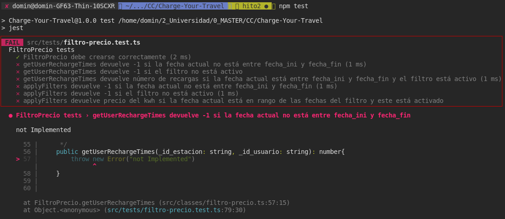
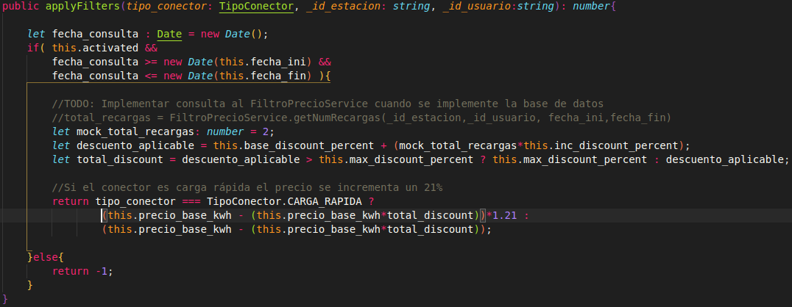
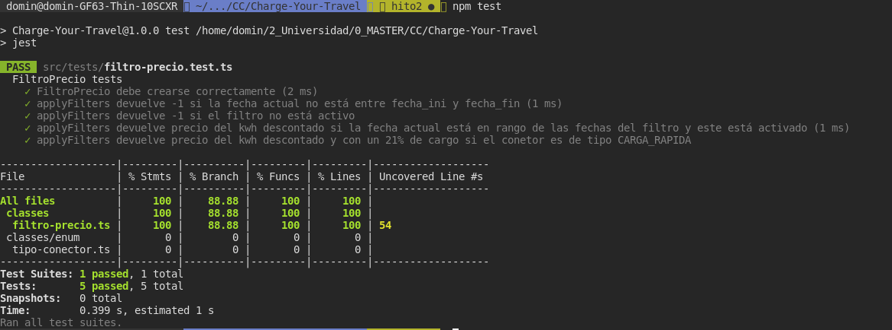

# TDD utilizando Jest

Siguiendo las pautas de TDD debemos escribir primero los tests, y posteriormente escribir el código necesario para pasarlos. Una vez los hemos pasado se puede realizar un proceso de **Refactorización** para mejorar la legibilidad y eficiencia del código desarrollado. 

1. **Tests en Rojo**: \
    Primero se escriben los tests sin implementar nada de código

    

    Como es obvio fallarán todos. (En este caso hay uno que no falla dado que es un test simple de comprobación de argumentos del Constructor de una clase).

2. **Implementamos el código necesario**

    

3. **Comprobación de que el código desarrollado pasa los tests**

    

    Como puede verse en los tests pasados existe una *rama* del código que no es testeada y el framework de test **Jest nos indica en qué linea se produce la bifurcación** (Se observa %Branch = 88% y línea sin cubrir 54), por lo que es buen indicador para que corrijamos el test si fuera necesario.