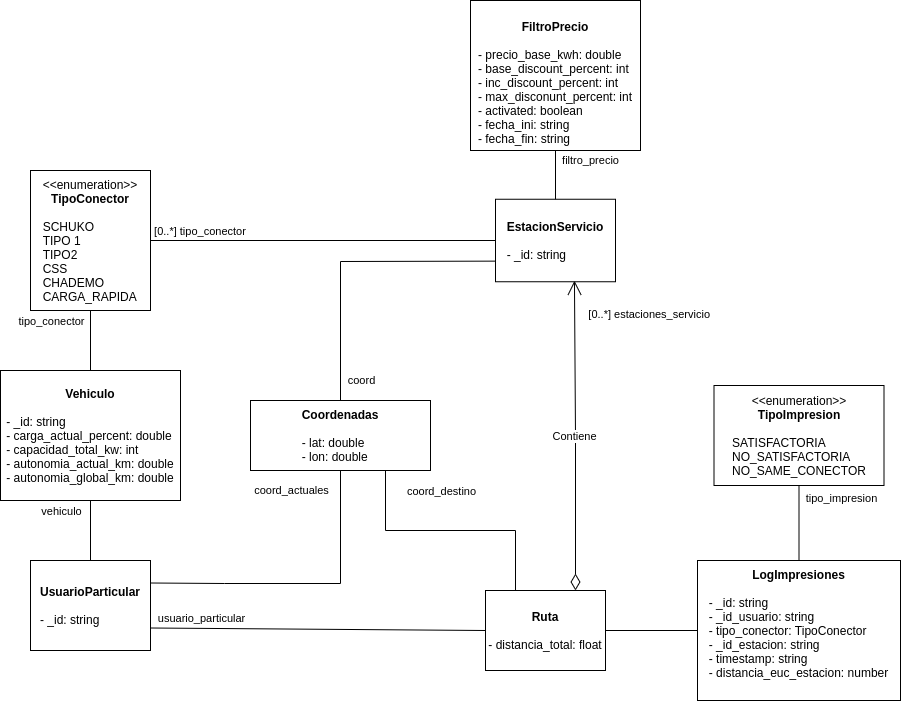

# Diagrama de clases del diseño

En la siguiente imagen podemos observar la primera versión del diagrama de clases:

Podemos distinguir las siguientes entidades siguiendo a grandes rasgos el [enfoque DDD](https://medium.com/@jonathanloscalzo/domain-driven-design-principios-beneficios-y-elementos-segunda-parte-337d77dc8566) :

UsuarioParticular:
- _id : identificador único del usuario
- Vehiculo []: array de vehículos del usuario

Vehículo:
- _id : identificador único del vehículo
- carga_actual_percent: porcentaje de carga actual del vehículo
- capacidad_total_kw: capacidad de la batería en Kw
- autonomia_actual_km: autonomía actual del vehículo en Km
- autonomia_global_km: autonomía total del vehículo en Km
- TipoConector: Tipo de conector de carga del vehículo

EstacionServicio:
- _id: identificador único de la estación de servicio
- lat: latitud de la estación de servicio
- lon: longitud de la estación de servicio
- TipoConector []: array de conectores disponibles en la estación de servicio.
- FiltroPrecio: Filtro actual (descuento) a aplicar en el precio de la recarga eléctrica de vehículos.

El enumerado **TipoConector** podría considerarse como un **objeto de valor** ya que no es un objeto que podamos identificar inequívocamente por un identificador único y persistente en el tiempo. Simplemente aporta valor sobre el tipo de conector del que dispone el vehículo eléctrico.

La clase **FiltroPrecio** también es un objeto de valor que no tiene identidad propia y no tendría sentido sin la clase *EstacionServicio*.

FiltroPrecio:
- precio_base_kwh: precio del Kw/h en la estación del servicio.
- base_discount_percent: descuento base a aplicar por la estación de servicio en cada recarga.
- inc_discount_percent: incremento del descuento por cada recarga acumulativa.
- max_discount_percent: descuento máximo a aplicar por recargas acumulativas.
- activated: booleano que indica si se debe aplicar el filtro de precio o no.
- fecha_ini: fecha de inicio de la aplicación del descuento.
- fecha_fin: fecha fin de la aplicación del descuento.

La clase **Ruta** podría considerarse también un objeto de valor, ya que están asociados a objetos del dominio del problema sin tener una identidad propia. Aportará la ruta óptima (tras la ejecución de un algoritmo de optimización) al usuario, siendo el grueso de la lógica de negocio del sistema.

Ruta:
- distancia_total: distancia a recorrer durante la ruta para llegar al destino.
- lat_ini: latitud del punto origen.
- lon_ini: longitud del punto origen.
- lat_fin: latitud del punto destino.
- lon_fin: longitud del punto destino.
- UsuarioParticular: usuario que inicia la ruta.
- EstacionServicio []: estaciones de servicio posibles para la ruta.