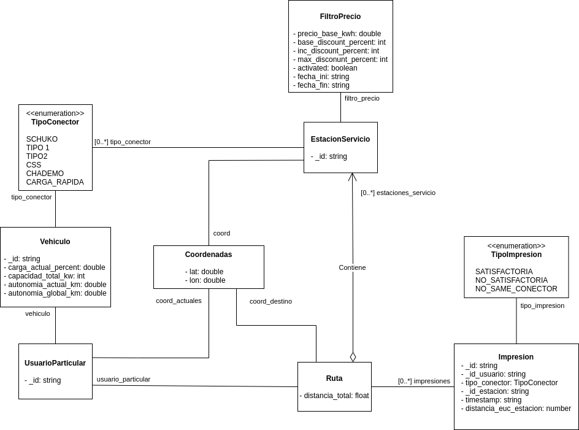

# Diagrama de clases del diseño

En la siguiente imagen podemos observar la primera versión del diagrama de clases:

Podemos distinguir las siguientes entidades siguiendo a grandes rasgos el [enfoque DDD](https://medium.com/@jonathanloscalzo/domain-driven-design-principios-beneficios-y-elementos-segunda-parte-337d77dc8566) :

UsuarioParticular:
- _id : identificador único del usuario
- vh_en_uso: identificador del vehículo en uso de los disponibles por el usuario
- Vehiculo []: array de vehículos del usuario

Vehículo:
- _id : identificador único del vehículo
- carga_actual_percent: porcentaje de carga actual del vehículo
- capacidad_total_kw: capacidad de la batería en Kw
- autonomia_actual_km: autonomía actual del vehículo en Km
- autonomia_global_km: autonomía total del vehículo en Km
- TipoConector: Tipo de conector de carga del vehículo

EstacionServicio:
- _id: identificador único de la estación de servicio
- lat: latitud de la estación de servicio
- lon: longitud de la estación de servicio
- TipoConector []: array de conectores disponibles en la estación de servicio.
- FiltroPrecio: Filtro actual (descuento) a aplicar en el precio de la recarga eléctrica de vehículos.

Ruta:
- distancia_total: distancia a recorrer durante la ruta para llegar al destino.
- lat_ini: latitud del punto origen.
- lon_ini: longitud del punto origen.
- lat_fin: latitud del punto destino.
- lon_fin: longitud del punto destino.

El enumerado **TipoConector** podría considerarse como un **objeto de valor** ya que no es un objeto que podamos identificar inequívocamente por un identificador único y persistente en el tiempo. Simplemente aporta valor sobre el tipo de conector del que dispone el vehículo eléctrico.

La clase **FiltroPrecio** podría considerarse como un **agregado**, ya que está asociado a un objeto del dominio del problema, en este caso la entidad *EstacionServicio*, y sin la cual no tendría sentido en el dominio.