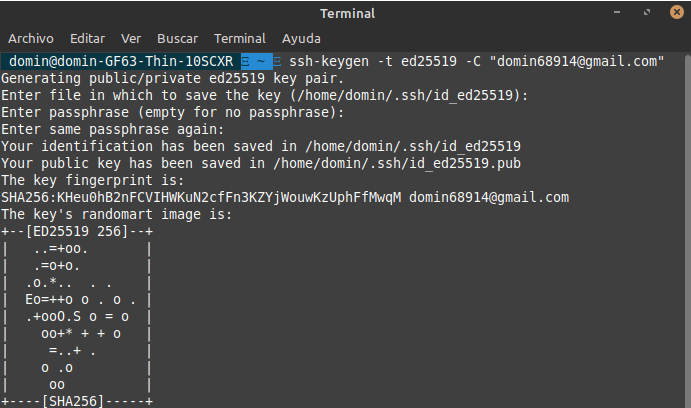
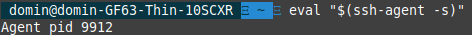
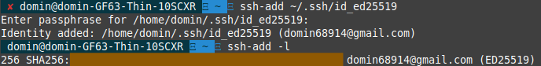
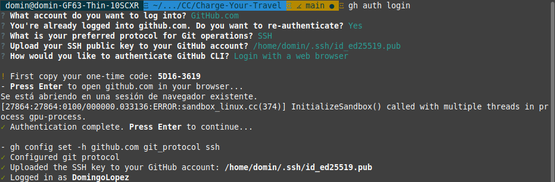
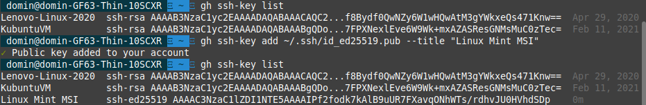
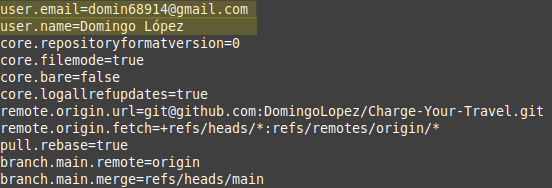

# Configuración del entorno 

El presente proyecto utilizará git y github como repositorio de fuentes colaborativo y abierto. Para ello se realizará un configuración previa del entorno para habilitar estas tecnologías y seguir buenas prácticas a la hora de utilizarlas. Se da por hecho que **se ha instalado git y se dispone de una cuenta en github**.   


## Creación de par de claves pública-privada :closed_lock_with_key:

### Generación de claves

Para poder realizar operaciones via ssh necesitamos crear un par de claves pública y privada con las que poder operar con el repositorio de github remoto de forma segura y rápida. Para ello, comenzaremos creando este par de claves con el comando:   

```
ssh-keygen -t ed25519 -C "domin68914@gmail.com"
```

donde -t indica la firma, en este caso [ed25519](https://ed25519.cr.yp.to/index.html) y -C para añadir un comentario con nuestro correo.



Esto genera un par de clave público - privada en ~/.ssh/

A continuación las añadimos al agente ssh. En primer lugar comprobamos que el agente está corriendo con:

```
eval "$(ssh-agent -s)"
```



y posteriormente añadimos la clave privada al agente con 

```
ssh-add ~/.ssh/id_ed25519
```




### Subida de clave pública a github :key:

Existen diversas maneras de realizar esto, tanto de por línea de comandos como de forma gráfica. En este caso he decidido utilizar [gh](https://github.com/cli/cli) por ser algo distinto a como se suele hacer, además de ser muy sencillo. En primer lugar nos autenticamos a través del cli de github *gh*.

```
gh auth login
```
Al hacerlo y siguiendo los pasos que nos indica nos dará la opción de subir una clave pública ssh (autodetectada por el cli), con lo que ya habríamos subido la clave. 



También podríamos subirla de manera manual, ejecutanto:

```
gh ssh-key add ~/.ssh/id_ed25519.pub --title "Linux Mint MSI"
```

Como vemos, hemos subido nuestra clave pública al almacén de claves de github:



## Configuración del nombre y correo electrónico en git

Para poder identificar nuestros *commits* debemos configurar git para tal propósito añadiendo nuestro nombre y correo electrónico a la configuración de este. Para ello, podemos ejecutar:

```
git config --global user.name "Domingo López"
```
```
git config --global user.email domin68914@gmail.com
```

Podemos comprobar la configuración de git utilizando:
```
git config --list 
```


## Configuración para hacer --rebase en cada pull

Siempre que hagamos un push debemos hacer antes un *pull* con *--rebase* para evitar conflictos en caso de que se haya avanzado más en la rama de la que dependemos. Podemos configurar git para que cada vez que hagamos pull se lance internamente el comando --rebase. Para ello podemos ejecutar en nuestro directorio de trabajo:

```
git config pull.rebase true
```

Se podría utilizar la opción *--global* para que afectara a todo el entorno de git, pero de momento lo haremos en el directorio de trabajo del proyecto para que solamente afecte a este.

