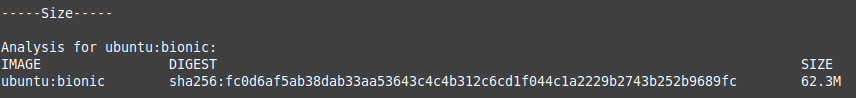
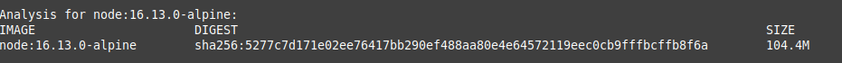

# Elección del contenedor base

Se define el proceso seguido para la elección del contenedor base.

## Comparación de imágenes de DockerHub.

En primer lugar, y dado que el proyecto está siendo desarrollado en Typescript, lo primero que se viene a la mente es buscar *Typescript* en el buscador de DockerHub, obteniendo algunos resultados. 

De todos los que aparecen podría servirnos la primera, ya que es la que más descargas tiene, así como estrellas. El problema es que utiliza bower, gulp, webpack...Herramientas que no se utilizan de momento en el proyecto. 

Podría ser una buena imagen para un proyecto que vaya a *tiro hecho*, pero se necesita algo más *personalizado* para nuestro propósito. 

Para este proyecto basado en Typescript, y que hace uso de NodeJs y npm es más interesante encontrar la imagen más liviana posible, para posteriormente instalar las dependencias del proyecto a través del *package.json*.

## Herramienta container-diff

Para poder comparar distintas imágenes sin tener que probarlas podemos utilizar una sencilla herramienta como [container-diff](https://github.com/GoogleContainerTools/container-diff), que nos provee cierta información referente a la imagen.

Su uso es sencillo:

>$container-diff analyze {imagen} --type=size --type=apt --type=history

Esta herramienta nos muestra mucha información sobre la imagen que escojamos.
Vamos a comparar la anterior imagen de Typescript y algunas imágenes de linux:

- Ubuntu bionic

- Alpine@3.14

- NodeJS slim

- NodeJS Alpine

- Imagen Typescript con más estrellas

Como se observa la imagen de menor tamaño (5.3M) es Alpine (versión major 3.14). El *inconveniente* (que a la vez es su mayor ventaja) de Alpine es que no trae absolutamente ningún paquete instalado, siendo considerada como una de las imágenes más livianas disponibles en DockerHub. Deberíamos instalar nodejs como mínimo en el contenedor, así como las herramientas que necesite NodeJs.

Tanto Alpine como la imagen de NodeJs-alpine (que es NodeJS sobre Alpine) me parecen buena elección. En este caso **la opción más razonable es elegir node:16.13.0-alpine, que incluye exclusivamente lo necesario para disponer de un entorno con NodeJS con la última versión lts, y es lo recomendado en la [documentación de NodeJs en DockerHub](https://hub.docker.com/_/node?tab=description)**
## Algunas prácticas interesantes

Un artículo que circula por la red y me ha parecido interesante es el [siguiente](https://medium.com/@michalozogan/how-to-build-the-smallest-docker-typescript-image-a9a84d17e6b4), donde se incita a evitar utilizar imágenes con tag *latest* ya que no estaríamos controlando actualizaciones mayores que se produzcan en el contenedor base, recomendando en cambio utilizar versiones *major*. 

[Este es otro artículo](https://testdriven.io/blog/docker-best-practices/) interesante sobre optimización de imágenes, destacando el *multistage build*, el uso de contenedores no privilegiados y buenas prácticas en general.
