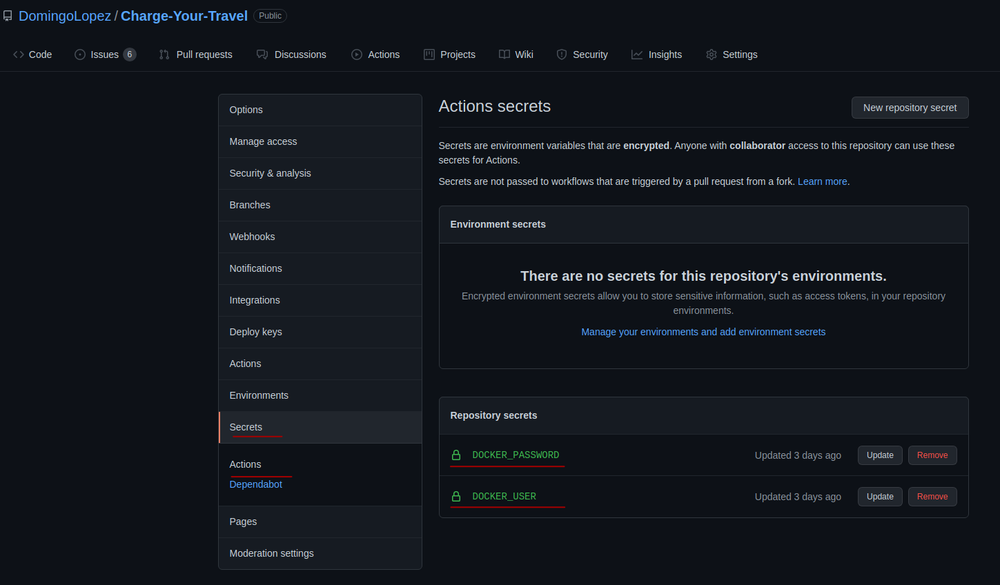
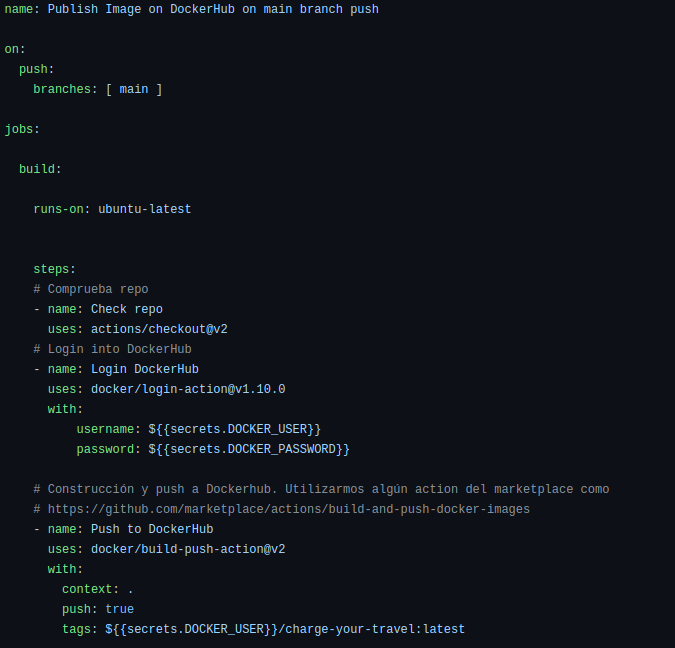

# Actualización automática en DockerHub a través de Github Actions

Se muestra el proceso seguido para la creación de un Workflow en Github que permite hacer login en nuestra cuenta de DockerHub y actualizar el repositorio de la imagen creada para realizar los tests del proyecto cuando hacemos *push* a la rama principal utilizando diversas *actions* de Github. 

## Configuración previa

Para poder hacer login y posterior push de nuestra imagen al repositorio de DockerHub debemos poder autenticarnos en este, para ello debemos hacer accesible al sistema que monta Github en los Workflows de nuestros datos de acceso. La manera que tiene Github de almacenar estos datos sensibles es a través de los *secrets*, que no dejan de ser pares *key: value* donde almacenar nuestras credenciales, de forma cifrada y segura. 

Para ello, debemos acceder al apartado *Settings > Secrets* de nuestro repositorio de Github, y establecer aquellas variables que necesitemos. En este caso, necesitamos el **usuario de DockerHub** y la **contraseña** que utilizamos para loguearnos en esta plataforma. 

Una vez establecidas podemos añadir un nuevo Workflow a nuestro repositorio accediendo al apartado *Actions > New Workflow* que nos permitirá crear una serie de pasos a ejecutar por el entorno que proporciona Github. Este Workflow se programa en el *lenguaje* YML y la documentación de Github Actions puede encontrarse [aquí](https://docs.github.com/es/actions).

Los workflows se basan en *eventos*, definidos por la key *on*. En este caso estamos diciendo *on push main (Al hacer push en la rama main)* -> *Ejecuta estos jobs*, donde utilizamos la última versión de ubuntu como entorno base para el Workflow. 

Posteriormente ejecutamos una serie de pasos, cada uno identificado con su *name*. 

La palabra reservada *uses* es común en las Github Actions ya que estamos indicando que se debe usar una action determinada. Con *with* estamos indicando aquellos parámetros que la action utilizará:

> **actions/checkout@v2** : Action disponible en el marketplace de Github Actions que comprueba diversas opciones del repositorio. https://github.com/marketplace/actions/checkout

> **docker/login-action@v1.10.0** : Action disponible en el marketplace de Github y oficial de Docker que hace login en la plataforma de registro de contenedores elegida. **Por defecto es DockerHub, para cambiarlo habría que añadir el key registry**. https://github.com/marketplace/actions/docker-login. En este caso necesita el nombre de usuario y la contraseña de DockerHUB, que previamente hemos guardado en las secrets del repositorio.

> **docker/build-push-action@v2** : Action disponible en el marketplace de Github y oficial de Docker que construye y hace push de una imagen al repositorio de dockerhub. https://github.com/marketplace/actions/build-and-push-docker-images. Notar la key *tags* que permite indicar la etiqueta de la imagen. Dado que no se trata de una *release* en particular, utilizamos la tag *latest* para indicar que es la última versión.

