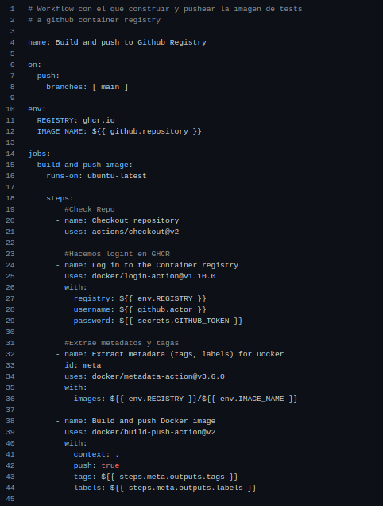

# Actualización automática en Github Container Registry a través de Github Actions

Se muestra el proceso seguido para la creación de un Workflow en Github que permite hacer login en Github Container Registry y actualizar el package del repositorio que contiene la imagen para ejecutar los tests del proyecto al hacer *push* en la rama principal.

## Workflow

Dado que ya se ha realizado un Workflow similar en la [actualización automática de la imagen en DockerHub](github-actions-dockerhub.md), solo se comentará aquello que sea distinto, ya que existen diversas *actions* que nos facilitan la vida a la hora de hacer estas tareas.

Lo más destacado es el uso **${{secrets.GITHUB_TOKEN}}** que es un token que genera Github en el entorno de ejecución para comprobar que efectivamente somos nosotros quien está lanzando el action.

Posteriormente se utiliza una action *docker/metadata-action@v3.6.0* para extraer los metadatos necesarios para poder *taggear* y añadir *labels* a la imagen que se está tratando.

Finalmente se usa la misma action que se utilizó para hacer push en Dockerhub.

